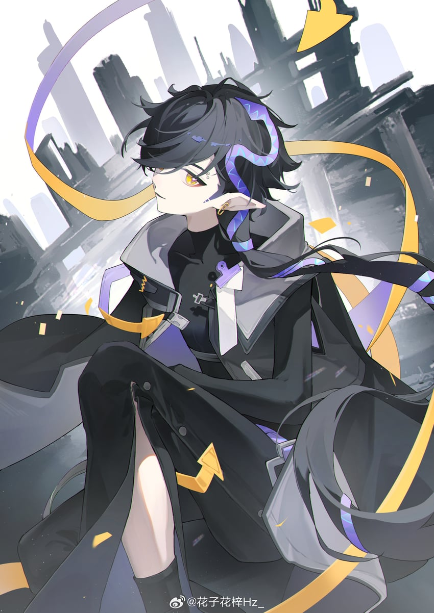

# Kereseth

## Informacje osobowe

Imię i nazwisko: Kereseth\
Atrybut: Węże\
Wiek: ---\
Wzrost: ---\
Waga: ---\
Broń: shurikeny\
Władający: ===

## Opis

Keresth nie należy do najmilszych osób. Nie jest w żadnym przypadku wrażliwy, często rzuca żartami, którymi nie powinien oraz nie przejmuje się niczyim losem. Cechuje się wielkim sprytem oraz zdolnościami manipulacyjnymi, dlatego powinno się być ostrożnym w jego towarzystwie.

## Jak zdobyć?

Ta furia nie ma żadnych specjalnych warunków na zdobycie, wystarczy z nią pogadać.

## Umiejętności

<- Brak ->

## Tiery

<- Brak ->

## Wizerunek

### Postać

<figure><figcaption>
z Arknight jako inspiracja
</figcaption></figure>

### Broń

<figure><figcaption></figcaption></figure>
