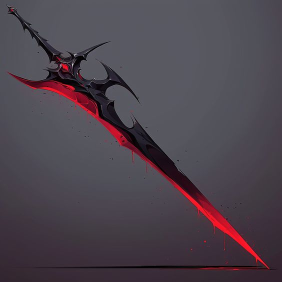

# Soen Ika

## Informacje osobowe

Imię i nazwisko: Soen Ika\
Atrybut: cisza\
Wiek: 506\
Wzrost: 1,67m\
Waga: 55kg\
Broń: miecz jednoręczny\
Władający: ===

## Opis

Soen jest jedną z przyjaźniejszych furii. Świadczy o tym chociażby przyjaźń jej i Junko. Furia ciszy jest też najbardziej skrytą w sobie furią, dopóki się jej nie zapytasz nic ci nie powie. Wyjątkiem są osoby z którymi jest zaprzyjaźniona. Jednym z jej hobby jest jedzenie.

## Jak zdobyć?

Ta furia nie ma żadnych specjalnych warunków na zdobycie, wystarczy z nią pogadać.

## Umiejętności

Brak

## Tiery

Brak

## Wizerunek

### Postać

<figure><figcaption></figcaption></figure>

### Broń

<figure><figcaption></figcaption></figure>

## Więcej informacji

Soen początkowo była człowiekiem, żyła jako zwykła dziewczyna - Chloe Kowloon. Ze względu na to, że jej ojciec był władającym [Kha](khazin-ika.md), jej rodzina została zaatakowana. Jej rodzice zginęli na miejscu, ona została odratowana przez Furię ( [khazin-ika.md](khazin-ika.md "mention") ), w wyniku czego sama nią została.
